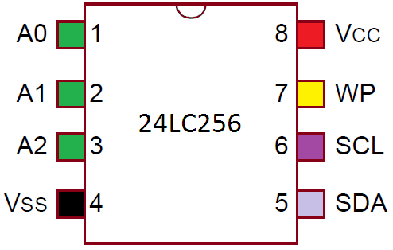

# Reconnaissance


# Attaque

## Dump du contenu

Le contenu d'une mémoire EEPROM peut être dumpé à partir d'un device tiers.

Avant de procéder, il est préférable de connaitre l'adresse [I2C](i2c) utilisée par le device.
Egallement à partir de la référence de l'EEPROM il faudra découvrir le cablage à effectuer. Par exemple sur une 24lc256 :



### Wiring

WP correspond à Write Protection (protection d'écriture), si ce pin est relié à GND il est possible d'écrire sur l'EEPROM. Dans le cadre d'une lecture cela n'a pas d'incidence.
Les pins A0/A1/A2 permettent de faire varier l'adresse I2C de l'équipement si ils sont relié à 5v. Il est ainsi possible d'avoir 8 EEPROM en parallèle (Si du courant est envoyé dans ce pin le bit passe à 1 et ansi 2^3=8 adresses possibles)

VCC : 5v
GND(VSS) : GND
WP : GND ou rien
A0/A1/A2 : GND ou rien
SDA : Pin i2c
SCL : Pin i2c

### Arduino

```C
#include <Wire.h>

#define EEPROM_ADDR 0x50   // Default I2C address for 24LC256
#define EEPROM_SIZE 32768  // Total size in bytes (32KB)
#define CHUNK_SIZE 32      // Read in smaller chunks for better performance

void setup() {
  Wire.begin();
  Serial.begin(9600);

  Serial.println("Dumping EEPROM data...");
  dumpEEPROM();
}

void loop() {
  // Nothing to do here
}

// Function to dump all data from EEPROM
void dumpEEPROM() {
  uint8_t buffer[CHUNK_SIZE]; // Temporary buffer to store data
  for (uint16_t address = 0; address < EEPROM_SIZE; address += CHUNK_SIZE) {
    readFromEEPROM(address, buffer, CHUNK_SIZE);
    printBuffer(address, buffer, CHUNK_SIZE);
  }
  Serial.println("Dump complete!");
}

// Function to read data from EEPROM
void readFromEEPROM(uint16_t address, uint8_t* buffer, size_t length) {
  Wire.beginTransmission(EEPROM_ADDR);
  Wire.write((address >> 8) & 0xFF); // High byte of memory address
  Wire.write(address & 0xFF);        // Low byte of memory address
  Wire.endTransmission();

  Wire.requestFrom(EEPROM_ADDR, length);
  for (size_t i = 0; i < length; i++) {
    if (Wire.available()) {
      buffer[i] = Wire.read();
    }
  }
}

// Function to print buffer data in a readable format
void printBuffer(uint16_t address, uint8_t* buffer, size_t length) {
  Serial.print("0x");
  Serial.print(address, HEX);
  Serial.print(": ");
  for (size_t i = 0; i < length; i++) {
    if (buffer[i] < 16) Serial.print("0"); // Leading zero for single-digit hex values
    Serial.print(buffer[i], HEX);
    Serial.print(" ");
  }
  Serial.println();
}
```

### Raspberry Pico

# Protections
